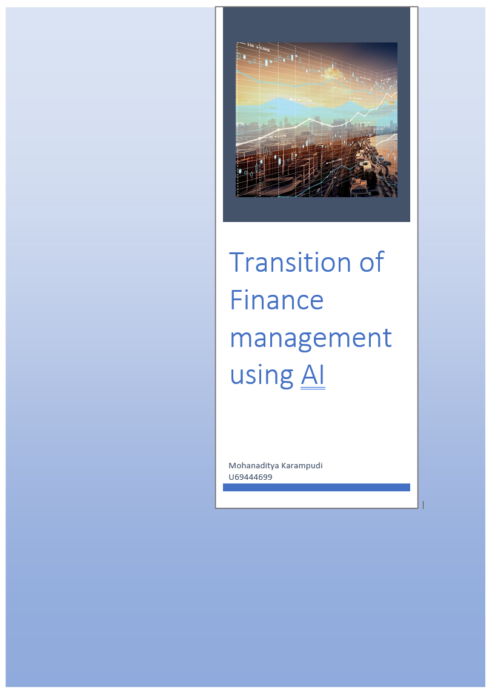
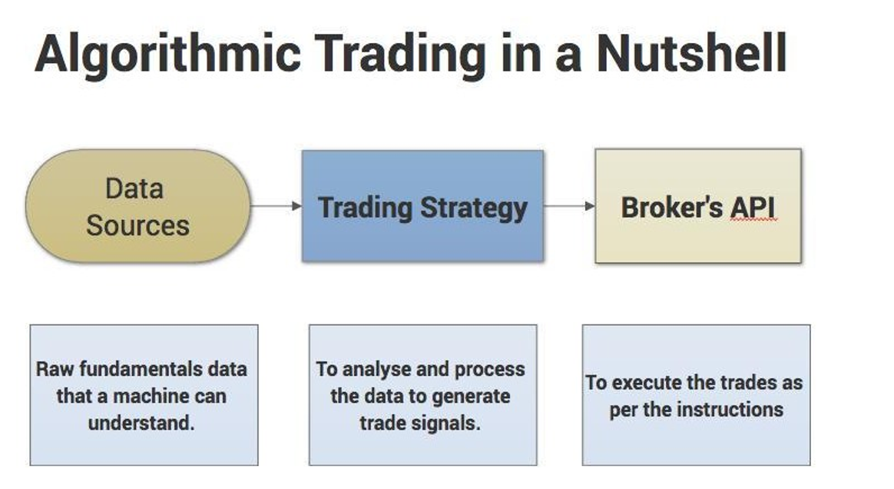

> 
>
> **Contents**

[A Brief Overview of Artificial Intelligence
2](#a-brief-overview-of-artificial-intelligence)

[Portfolio Management 3](#portfolio-management)

[Algorithmic Trading 7](#algorithmic-trading)

[Fraud Detection 11](#fraud-detection)

Predictive Analytics for Identifying High-risk Customer Behaviour 14

[AI powered Insurance 17](#ai-powered-insurance)

> I still remember during USA Financial economic crisis in 2008, John
> Paulson made billions of dollars by betting millions against the
> Housing Market. John made such a daring move because he inferred such
> happening patterns from the data.
>
> As data is being stored digitally, the finance sector now has the
> leverage to use this data for creating Machine Learning models.
> Algorithms are quickly evolving and changing the way we do banking.
> With the feasibility of having different digital payments to using
> them for fraud detection.
>
> There are different areas in which Machine Learning is applied. This
> case study will be the overview of how exactly are these implemented.

A Brief Overview of Artificial Intelligence
===========================================

> At its simplest, Artificial Intelligence (AI) is a set of computerized
> tools designed to achieve objectives that usually require human
> intelligence.
>
> From a business perspective, AI can be used to conduct operations in a
> faster, cheaper and more accurate way. AI can help automate labour
> intensive processes, leading to lower costs and saved time. AI can
> also be used to understand customers better --- companies can use AI
> to analyse the data they have on customers to predict customer
> behaviour, understand preferences and optimize price and product
> offerings.
>
> AI is comprised of many related technologies, some of which are:

-   **Machine learning:** involves training computers to identify
    patterns in data and/or predict outcomes. Other AI technologies are
    applications of machine learning. Machine learning is often used to
    develop quantitative trading strategies.

-   **Deep learning:** an application of machine learning where a model
    can analyze and draw conclusions from data, and solve problems
    without being trained or given explicit instructions or frameworks.
    These models learn by themselves.

-   **Neural networks:** algorithms designed to mimic the human brain
    and recognize patterns in data. They can identify, classify and
    analyze diverse data, and can find patterns that are too complex for
    human programmers to write code for. A fun example of deep learning
    and neural network is Goolge's
    [QuickDraw](https://quickdraw.withgoogle.com/), a sketching game
    which uses a massive database of user sketches to accurately guess
    what you're drawing.

-   **Natural language processing:** helps computers understand,
    interpret, and respond in written text or speech. This tech is
    commonly used by chatbots.

> There are many more subsets of AI, but the key takeaways are:

-   AI algorithms are used to classify and study data, and identify
    relationships

-   When applied to data sets, AI can be used for pattern recognition,
    optimization and prediction

-   AI can classify and analyze data in different formats: text, speech,
    image, video, etc. It can also work with structured (i.e. labelled
    data) and unstructured data.

-   Machine learning algorithms learn by being fed large data sets of
    labelled data. Once they can identify the correct conclusions from
    known data set, they can be applied to real-world problems.

> There are quite few applications of these concepts in Finance domain.
> This report gives an overview of how is Machine Learning shaping
> different aspects in the finance industry.

Portfolio Management:
=====================

> Managing customer's portfolio gets trickier as the number of customers
> increase. With usage of Algorithms and statistics it becomes a breeze
> to automatically establish and manage portfolios.
>
> Asset management firms can reap substantial benefits through the
> adoption of AI and machine learning. These technologies can help
> provide real-time actionable insights, and facilitate portfolio
> management decisions. Let\'s look at the framework for some of the use
> cases.
>
> **Social media analytics:** The firm\'s portfolio holdings, social
> media data from Twitter, Facebook and other micro blogging sites, are
> consolidated to provide sentiment analysis, pattern charts, and so on
> for a given portfolio. This is also useful in studying client
> demographics and preferences, and suggesting relevant products to
> customers.
>
> {width="5.8622090988626425in"
> height="3.2708333333333335in"}
>
> The framework should take in data from various sources like social
> media and blogs, and feed it through an engine with social analytics
> tools to provide sentiment analysis, insights, trends, patterns and
> alerts. It should be customizable to the needs of the asset management
> firms. The solution should be equipped with user interface frameworks
> to facilitate interactive and customized data visualization.
>
> The solution should also include a recommendation framework that
> combines structured and unstructured data to provide contextual
> information summary, along with investment recommendations. The
> framework should facilitate classification and clustering of
>
> structured and unstructured data; filtering of stock recommendation
> reports for suitability; and unstructured data processing including
> real time events capture, NLP, and sentiment analysis (see Figure 2).
>
> {width="6.7369291338582675in"
> height="3.6943744531933507in"}
>
> The framework should include a customizable dashboard to enable the
> portfolio manager to make smart decisions. The dashboard should allow
> configuration of some of the preferences like sectors, demographics,
> and so on. The portfolio manager\'s personalized dashboard should
> ideally include features such as

-   **Current holdings dashboard** displaying grouping, segregation,
    fund-wise holdings, and so on.

-   **Recommendation or events dashboard** displaying analyst reports
    and recommendation analytics -- relevance, consolidation, social
    sentiment analysis of stocks based on current client holdings and
    firm preferences. The dashboard should be customized based on firm
    preferences like geography, sector, investment preferences, and
    mandates.

-   **News and event analytics**: The solution framework should gather
    all relevant news and events from various sources like analyst
    websites, blogs, and research firms, and perform analytics on them.
    Some of the news and event analytics that should be performed are:
    Event categorization: Classify news into opinions, press release,
    blogs, analyst views, credit rating, and provide a timeline summary
    of published items. Event relevance: Provide features like entity
    tagging (people, company, government bodies, and others); stock,
    sector, and geography relevance for wealth manager portfolios;
    novelty rating (as the first instance of news creates greater
    impact); news volumes (list of sources offering similar news and
    opinions); and events alert calendar. Event impact: Facilitate
    impact-mapping based on the type of risk, and corresponding impact
    such as high-risk (bankruptcy, CEO-related, and others) and
    high-impact (mergers and acquisitions, regulatory actions,
    divestments).

-   **Historical event analytics:** Perform historical analysis of
    events against stock performance for the past and present timelines.

Challenges:
-----------

> Challenges Firms can face certain challenges in implementing the
> recommended solution. These are:

-   **Inadequate tools and techniques**: Many organizations lack proper
    tools and

> techniques to assimilate deeper insights from research reports. They
> also find it challenging to consolidate reports from multiple sources
> to arrive at meaningful decisions.

-   **Absence of real time information:** Lack of timely integration of
    internal and external information including customer holdings data,
    portfolio manager preferences, research reports, social media data,
    and news can affect decision making considerably.

-   **Ineffective visualization:** Appropriate visualization tools need
    to developed to present interactive graphs, charts for stock
    performance with regard to holdings, external news, and events so
    that they are easily interpreted by portfolio managers. Firms also
    need to implement NLP-based search and query facilities.

Conclusion
----------

> Financial institutions are going through a wave of change such as
> changing demographics and customer expectations, tighter regulations,
> disruptive digital technologies, and rising competition from fintech
> companies. To address these challenges, banks can collaborate with
> fintech companies that provide innovative solutions in the area of AI.
> However,
>
> individual firms will need to customize the solution as per their
> investment strategies and algorithm requirements. Firms must also
> consider their data and supervised learning requirements, and model
> accuracy while choosing the solution. Embracing newer technologies
> such as AI and machine learning will help banks unlock the value of
> data to drive informed decision making, which is imperative to
> business growth.
>
> References:

-   [[https://medium.com/swlh/ai-for-portfolio-management-from-markowitz-to-]{.underline}](https://medium.com/swlh/ai-for-portfolio-management-from-markowitz-to-reinforcement-learning-cffedcbba566)
    [[reinforcement-learning-cffedcbba566]{.underline}](https://medium.com/swlh/ai-for-portfolio-management-from-markowitz-to-reinforcement-learning-cffedcbba566)

-   [[https://www.tcs.com/content/dam/tcs/pdf/Industries/Banking%20and%20Financial]{.underline}](https://www.tcs.com/content/dam/tcs/pdf/Industries/Banking%20and%20Financial%20Services/analytics-artificial-intelligence-machine-learning-0817-1.pdf)

> [[%20Services/analytics-artificial-intelligence-machine-learning-0817-1.pdf]{.underline}](https://www.tcs.com/content/dam/tcs/pdf/Industries/Banking%20and%20Financial%20Services/analytics-artificial-intelligence-machine-learning-0817-1.pdf)

-   [[https://www2.deloitte.com/content/dam/Deloitte/global/Documents/Financial-]{.underline}](https://www2.deloitte.com/content/dam/Deloitte/global/Documents/Financial-Services/fsi-artificial-intelligence-investment-mgmt.pdf)
    [[Services/fsi-artificial-intelligence-investment-mgmt.pdf]{.underline}](https://www2.deloitte.com/content/dam/Deloitte/global/Documents/Financial-Services/fsi-artificial-intelligence-investment-mgmt.pdf)

Algorithmic Trading
===================

> This is the picture of stock trading in 1980 vs Today

{width="5.280252624671916in" height="1.93375in"}

> Everything got automated and the Algorithms used for stock purchasing
> are powered by Machine Learning.
>
> Machine learning adds a layer of intelligence on top of algorithms by
> providing powerful tools to extract patterns from data processed all
> across the globe, giving technology the opportunity to study it in
> real time. The intelligent machine could very well lead the entire
> trading revolution owing to its evolution and newer technologies
> becoming predominant with every passing day.

{width="4.826936789151356in"
height="2.721874453193351in"}

> **Artificial Intelligence** (A.I.) might be able to trade in and out
> without any repercussions by itself as it would drive improvements for
> trading strategies.
>
> 
>
> The future systems could study all the historical data that we have
> archived over the course of the entire trading history, analyze it
> with ease to find out the trends, what would work and what would not.
> It could also teach itself to predict the future markets with ease
> while trading multiple accounts and strategies to spread risk and
> reject or accept real-time bids and offers. If the market does not
> favour your trading strategy rules, the system's self-learn algorithms
> would adjust trading to different patterns and alter the rules to
> match market conditions.
>
> It could be capable of checking out multiple market conditions across
> the globe simultaneously saving a lot of time and eliminating any
> possibility of the slightest gap in time or occurrence of an error.
>
> Market crashes might become a thing of the past with trading become
> sentient and realizing the impact of a buy/sell gone wrong, or market
> volatility to dip in the exchange and rising up to the challenge to
> recover from that without any human intervention. We can thus expect
> the elimination of certain discrepancies like Flash Crashes.
>
> Algorithms could be programmed into the chips directly for increased
> efficiency and easier communication. Specific global regulation and
> kill-switches could also be programmed.
>
> The benefits of AT include

-   the ability of trades to be executed at the best possible prices,

-   increased accuracy and a reduced likelihood of mistakes,

-   the ability to automatically and simultaneously check multiple
    market conditions

-   human errors caused by psychological or emotional conditions are
    likely to be reduced.

> In relation to the second benefit, the European Space Agency\'s Mosaic
> Smart Data algorithms are being now deployed to mitigate \"fat
> finger\" trades. A fat finger trade is where trader accidentally
> presses the wrong key. Mosaic Smart Data can be deployed to analyse
> millions of financial trading data points and have recently been high
> profile cases at Samsung and Deutsche Bank. The algorithms are also
> being adopted to detect fraud in the financial services industry
>
> Algorithmic systems often make thousands or millions of trades per
> day. The term given to this is HFT (High Frequency Trading). HFT is
> the most recognisable form of AT and uses high- speed communications
> and algorithms in financial market transactions. HFT has both its
> supporters and detractors. Since 2013, two-thirds of the top 30 cited
> papers on HFTs show positive market effects from HFTs . There are
> supporting arguments that HFT helps with price discovery and
> efficiency by trading in the direction of permanent price changes and
> in the opposite direction of transitory pricing errors. These types of
> trading improve market liquidity. Hendershott and Riordan (2013) find
> that HFT can provide market stability and Menkveld (2014) finds that
> HFT reduces trading costs. Hasbrouck and Saar (2013) provide evidence
> that HFT improves market quality and reduces bid-ask spreads. In fact,
> HFT is changing the traditional field of market microstructure and
> will continue to be reinvented through new AI and DL techniques. Most
> hedge funds and financial institutions do not openly disclose their AI
> approaches to trading (for proprietary reasons), but it is believed
> that ML and DL play an important role in calibrating real-time trading
> decisions. It also involves neural networks, fuzzy logic and pattern
> recognition. There are four common AT strategies that are now briefly
> described. Signal processing is a mathematical extension of technical
> analysis based on the art of filtering to eliminate noise and discern
> trading patterns.
>
> Secondly, there is a strategy is known as **market sentiment.** In
> this strategy the computer is entirely unaware of market activity
> until it is fed model market data flows and then the algorithm becomes
> aware of market agitation and participant activity. The objective of
> market sentiment is to provide the algorithm the appropriate context
> to analyse and learn market psychology of supply and demand.

Challenges
----------

> But along successes like these, there are plenty of problems too. To
> avoid them, AI watchers
>
> say it's important to understand the limits of the technology. Patel
> says: "AI can be divided into 'general' and 'narrow' intelligence.
> General intelligence is the fictional Hollywood destroy-mankind type.
> But narrow intelligence has existed for several years, typified by
> robots being used to build cars, essentially machines trained to carry
> out repetitive tasks."
>
> Machine learning goes a step further. AI systems have enough
> intelligence to learn from the data they are dealing with and improve
> their own operation. This too can be divided into supervised machine
> learning, which is monitored by humans, and unsupervised machine
> learning, which allows machines to interpret and process data on their
> own.
>
> Supervised machine learning is the prominent AI used in financial
> services. As Patel says: "In the trading environment we're using
> machine learning technologies to trade, for example, within extremely
> narrow 'guard rails' -- perhaps high-frequency trading. The
> applications we have seen don't offer the autonomy to actually choose
> what to buy and sell, but where to buy and sell. For example, order
> execution can be achieved by accessing multiple liquidity sources in a
> much more timely fashion. That's something we're already seeing." He
> adds: "The next stage we'll get to will take the guard rails off and
> the boundaries between which autonomy is permitted will widen."
>
> These suggestions are promising, but there are business and regulatory
> risks to using even supervised machine learning and related systems,
> and certainly to 'taking the guard rails off'.
>
> In business terms, Korada highlighted the drawbacks of the investment
> bank's trade anomaly detection system. The project's biggest problem
> was sourcing good quality data needed to train the detection models
> being set up. He said: "The quality of data was very poor and that
> took us a lot of time. You'd be amazed how difficult it is to get the
> good quality dataset that you need to train models and get something
> useful out of them."
>
> This case study pinpoints two key problems with machine learning:
> finding sufficient high- quality data to feed and train systems, and
> the scale of human effort required to run systems.
>
> References:
>
> [[https://blog.quantinsti.com/growth-future-algorithmic-trading/]{.underline}](https://blog.quantinsti.com/growth-future-algorithmic-trading/)
> [[https://www.turing.ac.uk/sites/default/files/2019-04/artificial\_intelligence\_in\_finance\_-]{.underline}](https://www.turing.ac.uk/sites/default/files/2019-04/artificial_intelligence_in_finance_-_turing_report_1.pdf)
>
> [[\_turing\_report\_1.pdf]{.underline}](https://www.turing.ac.uk/sites/default/files/2019-04/artificial_intelligence_in_finance_-_turing_report_1.pdf)
>
> [[https://a-teaminsight.com/potential-and-pitfalls-of-artificial-intelligence-in-the-trading-]{.underline}](https://a-teaminsight.com/potential-and-pitfalls-of-artificial-intelligence-in-the-trading-environment/?brand=ati)
> [[environment/?brand=at]{.underline}i](https://a-teaminsight.com/potential-and-pitfalls-of-artificial-intelligence-in-the-trading-environment/?brand=ati)

Fraud Detection
===============

> [Fraud is a massive problem for financial
> institutions](https://algorithmxlab.com/blog/2017/10/30/danske-bank-joins-others-using-ai-detect-fraud/)
> and one of the foremost reasons to leverage machine learning in
> finance. By creating anomaly detection algorithms. We can now flag a
> transaction within seconds after it happens.
>
> The concept behind using machine learning for fraud detection is that
> fraudulent transactions have specific features that legitimate
> transactions do not. Based on this assumption, machine learning
> algorithms detect patterns in financial operations and decide whether
> a given transaction is legitimate. Machine learning fraud detection
> algorithms are way more effective than humans. They can process a raft
> of information faster than a team of the best analysts ever could.
> What's more, ML algorithms can spot patterns that seem unrelated or go
> unnoticed by a human. By exploring and studying tons of cases of
> fraudulent behavior, ML algorithms determine the most stealthy
> fraudulent patterns and remember them forever.

{width="5.153267716535433in"
height="1.1236450131233595in"}

> Currently, businesses work on fraud detection systems that incorporate
> machine learning and artificial intelligence. Using modern fraud
> protection systems powered by ML, many industries can keep their
> finances safe. There are already some fraud detection solutions for
> FinTech, e-commerce, banking, healthcare, online gaming, and other
> industries. No matter your industry, there's always a way to benefit
> from AI and ML. Machine learning algorithms can process huge amounts
> of data and draw patterns for every business to protect it from fraud.
> For instance, machine learning helps online gaming businesses detect
> account takeovers and other scams by tracing patterns in a player's
> in-game behavior.
>
> [Capgemini](https://www.capgemini.com/in-en/wp-content/uploads/sites/6/2017/07/next-generation_fraud_management_solutions_for_banks_and_capital_market_firms.pdf)
> claims their ML fraud detection system can reduce fraud investigation
> time by 70% while increasing accuracy by 90%. Another ML fraud
> prevention solution provider,
> [Feedzai](https://feedzai.com/wp-content/uploads/2017/03/DML-Final.pdf),
> claims that a well-trained machine learning solution can identify and
> prevent 95% of all fraud while minimizing the amount of human labor
> required during the investigation stage.
>
> Large corporations like Airbnb, Yelp, and Jet.com are already using AI
> solutions to get insights from big data and prevent issues such as
> fake accounts, account takeover, payment fraud, and promotion abuse.
> Machine learning takes care of all the dirty work of data analysis and
> predictive analytics and allows companies to grow and develop safe
> from fraud.
>
> The machine learning advantage is that the high volume of
> transactional and customer data readily available in the financial
> services sector makes it ideal for the application of complex machine
> learning algorithms. Banks and financial institutions are able to
> automate the
>
> analysis of their customers' behavioral patterns for any signs of
> abnormality, giving them the
>
> ability to identify and flag fraudulent activity in real-time.

{width="6.137719816272966in"
height="2.983332239720035in"}

> As well as picking up known patterns, [machine learning is able to go
> a step further and
> 'learn'](https://www.netguru.com/services/machine-learning) [new
> patterns](https://www.netguru.com/services/machine-learning), without
> the need for human intervention. This allows models to adapt over time
> to uncover previously unknown patterns, or identify new tactics that
> might be employed by fraudsters.

{width="5.885416666666667in"
height="3.0416666666666665in"}

> Businesses all over the world have already started using data science
> to prevent financial fraud. Machine learning is currently the most
> promising innovative tool that can help companies prevent fraudulent
> operations that lead to greater losses each year. Yet apart from
> implementing modern fraud detection solutions, companies also need
> modern and
> [secure](https://www.intellias.com/custom-fintech-services-for-digital-banking/)
> [FinTech
> services](https://www.intellias.com/custom-fintech-services-for-digital-banking/)
> that are harder for fraudsters to manipulate. An outdated financial
> system is
>
> always full of loopholes tricksters can use. Luckily, machine learning
> has the potential to improve bank fraud detection with data analytics
> and help nearly every industry.
>
> References:

-   [[https://igniteoutsourcing.com/fintech/machine-learning-in-finance/]{.underline}](https://igniteoutsourcing.com/fintech/machine-learning-in-finance/)

-   [[https://algorithmxlab.com/blog/applications-machine-learning-]{.underline}](https://algorithmxlab.com/blog/applications-machine-learning-finance/#Portfolio_Management_Robo-Advisors)
    [[finance/\#Portfolio\_Management\_Robo-Advisors]{.underline}](https://algorithmxlab.com/blog/applications-machine-learning-finance/#Portfolio_Management_Robo-Advisors)

-   [[https://towardsdatascience.com/machine-learning-in-finance-why-what-how-]{.underline}](https://towardsdatascience.com/machine-learning-in-finance-why-what-how-d524a2357b56)
    [[d524a2357b56]{.underline}](https://towardsdatascience.com/machine-learning-in-finance-why-what-how-d524a2357b56)

-   [[https://emerj.com/ai-sector-overviews/machine-learning-in-finance/]{.underline}](https://emerj.com/ai-sector-overviews/machine-learning-in-finance/)

> Predictive Analytics for Identifying High-risk Customer Behaviour
> Although managers can be very confident when granting a loan,
> sometimes the borrower cannot repay the amount. This issue can be
> tackled by Machine Learning which predicts the probability of a person
> repaying the loan.
>
> The two most critical questions in the lending industry are:

-   How risky is the borrower?

-   Given the borrower's risk, should we lend him/her?

> With the risk of bad debts looming large, utility companies cannot
> afford to follow a one- schemefits-all policy for managing customer
> defaults. Most utilities charge their customers on a \'credit\' basis,
> that is, after the use of the service. Reliance on credit payment is
> not ideal for all customer categories, as customers tend to misuse
> this option. Utilities should first make efforts to identify and
> classify customers (both existing and new) into high- and low-risk
> segments and then develop targeted strategies to securitize revenue
> from high-risk customer segments.
>
> Predictive analytical models that assess risks during the onboarding
> of new customers use profile parameters such as income levels,
> demographics, and credit history. Most utilities have stringent SOPs
> for evaluating new customer applications; however, they often overlook
> risks lurking within existing customer accounts. Risks in existing
> customer accounts can be identified by analyzing additional
> information, such as, customer meter settings, usage patterns, payment
> history, and complaints and communication.

{width="5.07089457567804in" height="3.03375in"}

> Customers, who find it difficult to pay their utility dues, usually
> request for negotiation of payment terms and credit extensions from
> their utility providers. However, there are instances where customers
> default even after such options are provided and may opt for
> unscrupulous practices to escape payment. Some may pose as \'new\'
> customers and apply to the utility company for a new account, while
> some may move to new addresses frequently, without informing their
> utility suppliers. Although most utility companies ask for information
> on the account holder\'s name, the Social Security number, and / or
> tax ID, individuals resorting to the \'name game\' conceal these bits
> of information that can prove their links to other accounts. Utility
> companies that fail to identify customers with prior trailing dues,
> run into the cycle of customer defaults, bad debts and the resultant
> losses.
>
> Predictive data analytics helps identify fraudulent customers that
> have \'trailing\' debts and may resort to \'name game\' tactics to get
> away without paying their dues. The segment of potential defaulters
> can be further expanded by including more parameters such as customer
> profile and credit rating data from credit bureaus namely Equifax,
> Experian, and TransUnion. Identifying a larger number of customers
> under the ambit of potential defaulters further minimizes the risk of
> delinquencies.
>
> Vendors with expertise in data management (data collection, cleaning,
> preparation and analysis) can effectively assist utility companies
> prevent revenue leakage by spotting aliases and customers with high
> attrition risk.
>
> A proven predictive analytics model is one that allows utilities to
> segment customers based on two parameters --- the debt value the
> customer owes, and the propensity to pay back the debt. By plotting
> the outstanding dues on the x-axis and the propensity to pay back the
> debt on the y-axis, utilities can create a collections prioritization
> matrix (as shown in fig. 4) to decide on the next steps in the
> collections strategy.

{width="5.700520559930009in" height="2.82in"}

> This novel approach in segmentation on the basis of the customer\'s
> propensity to pay back the debt provides new insight for the debt
> collection strategy. As shown in fig. 4, customer accounts with high
> outstanding and propensity to pay are prioritized for accelerated in-
> house collections. On the other hand, a lower outstanding amount and
> propensity to pay accounts are written-off immediately as the effort
> and cost-to-collect the debt, exceeds the debt due on the customer
> amount. Proactive action upon identification of high-risk customers
> can help reduce bad debt write-offs by as much as 40 percent and
> securitize revenues for utility providers.
>
> Conclusion
>
> Reducing consumer bad debt write-offs has several benefits in the
> utility industry. These benefits have a positive effect on the
> day-to-day operations of the company and also impact its reputation in
> the market along with stakeholder relations.
>
> Utility companies need to reduce instances and volumes of consumer bad
> debt write-offs to stay competitive in a dynamic economic environment.
> What\'s more, they need to achieve this goal in the face of continuing
> challenges---shrinking income levels of consumers, stringent
> regulatory guidelines, and pressure from shareholders to optimize
> performance and returns on investment.
>
> Predictive analytics has emerged as a key enabler that helps segment
> customers into identical groups based on their attributes and
> formulate customized debt management and advisory policies targeted to
> a particular customer segment.
>
> Targeted strategies assure better performance and acceptance with the
> customer segment and helps reduce consumer bad debt write-offs and
> drive several significant business benefits, by improving customer
> satisfaction levels.
>
> References:

-   [[https://www.forbes.com/sites/forbesfinancecouncil/2018/10/05/what-role-can-machine-]{.underline}](https://www.forbes.com/sites/forbesfinancecouncil/2018/10/05/what-role-can-machine-learning-and-ai-play-in-banking-and-lending/#673107df4122)
    [[learning-and-ai-play-in-banking-and-lending/\#673107df4122]{.underline}](https://www.forbes.com/sites/forbesfinancecouncil/2018/10/05/what-role-can-machine-learning-and-ai-play-in-banking-and-lending/#673107df4122)

-   [[https://www.wns.com/Portals/0/Documents/Whitepapers/WNS-WP-how-a-predictive-]{.underline}](https://www.wns.com/Portals/0/Documents/Whitepapers/WNS-WP-how-a-predictive-analytics-based-framework-helps-reduce-bad-debts-in-utilities.pdf)
    [[analytics-based-framework-helps-reduce-bad-debts-in-utilities.pdf]{.underline}](https://www.wns.com/Portals/0/Documents/Whitepapers/WNS-WP-how-a-predictive-analytics-based-framework-helps-reduce-bad-debts-in-utilities.pdf)

-   [[https://lending-times.com/2019/07/23/how-machine-learning-will-transform-p2p-lending/]{.underline}](https://lending-times.com/2019/07/23/how-machine-learning-will-transform-p2p-lending/)

AI Powered Insurance
====================

> Insurance is often tedious as the claim can take up to 10 days to get
> processed. Such delays can never happen when a trained Algorithm
> evaluates the case.
>
> In this report we will look at:

-   Why the insurance industry needs AI solutions

-   What insurers are already doing in this area, and;

-   How AI will impact the industry in the foreseeable future.

> Insurance is an old and highly regulated industry. Perhaps because of
> this, insurance companies have been slower to embrace technological
> change compared to other industries. Insurance is still steeped in
> manual, paper-based processes that are slow and require human
> intervention. Even today, customers are faced with time-consuming
> paperwork and bureaucracy when getting a claim reimbursed or signing
> up for a new insurance policy.
>
> Customers may also end up paying more for insurance because policies
> are not tailored for their unique needs. In an age when most of our
> daily activities are online, digitized and convenient, insurance is
> not always a happy customer experience.
>
> That said, we are starting to see a global push by insurance companies
> to augment their technological capabilities so that they can do
> business faster, cheaper and more securely. In the past few years,
> there have been some prominent examples of insurers investing heavily
> in Artificial Intelligence solutions.
>
> McKinsey [estimates]{.underline} a potential annual value of up to
> \$1.1 trillion if AI tech is fully applied to the Insurance industry.
> Of this, the business areas that can benefit the most are:

-   **Sales and marketing**: machine learning can be used to price
    insurance policies more competitively and relevantly and recommend
    useful products to customers. Insurers can price products based on
    individual needs and lifestyle so that customers only pay for the
    coverage they need. This increases the appeal of insurance to a
    wider range of customers, some of whom may then purchase insurance
    for the first time.

-   **Risk**: Neural networks can be used to recognize fraud patterns
    and reduce fraudulent claims. According to the FBI, non-health
    insurance fraud in the US is
    [[estimated]{.underline}](https://www.fbi.gov/stats-services/publications/insurance-fraud)
    at over

> \$40 billion per year, which can cost families between \$400--700 per
> year in extra premiums. Machine learning can also be used to improve
> insurance companies' risks and actuarial models, which can potentially
> lead to more profitable products.

-   **Operations**: Chatbots using neural networks can be developed to
    understand and answer the bulk of customer queries over email, chat
    and phone calls. This can free up

> {width="6.156024715660543in"
> height="3.635in"}significant time and resources for insurers, which
> they can deploy towards more profitable activities.
>
> There are many examples of how insurers around the world are
> implementing AI to improve their bottom line as well as the customer
> experience.

Auto Insurance
==============

> As far back as 2017, US insurer **Liberty Mutual** unveiled a [new
> developer
> portal](https://www.greencarcongress.com/2017/01/20170104-solaria.html)
> through its innovation incubator [Solaria
> Labs](https://www.solarialabs.com/). This open API portal combines
> public data with proprietary insurance data to enable the creation of
> better insurance products for customers. One such product was
> reportedly a mobile app that allows drivers involved in accidents to
> assess damage to their car in real-time using their smartphone camera.
> The app would also provide repair cost estimates. The AI powering the
> app will be trained using thousands of images of car accidents.
>
> **[Ant Financial](https://www.antfin.com/family.htm),** the Chinese
> fintech firm part of the Chinese giant **Alibaba Group,** released
> software called [Ding Sun Bao](https://www.antfin.com/family.htm) to
> analyze car accident damage and process claims. Ding Sun Bao uses
> machine vision, enabling drivers to take pictures of their damaged car
> using their smartphone camera. The app then compares the photo with
> its image database to determine the severity of damage, estimate
> repair costs, and analyze the accident's impact on the
>
> driver's future insurance premiums. Crucially, Ant Financial claims
> that the app assesses damages and handles claims in *six seconds,*
> whereas human claims adjusters reportedly take around six minutes and
> 48 seconds.
>
> References:
>
> [[https://marutitech.com/ai-in-the-insurance-industry/]{.underline}](https://marutitech.com/ai-in-the-insurance-industry/)
> [[https://www.pymnts.com/disbursements/2019/how-ai-ml-are-revitalizing-the-insurance-claims-]{.underline}](https://www.pymnts.com/disbursements/2019/how-ai-ml-are-revitalizing-the-insurance-claims-process/)
> [[process/]{.underline}](https://www.pymnts.com/disbursements/2019/how-ai-ml-are-revitalizing-the-insurance-claims-process/)
>
> [[https://emerj.com/ai-sector-overviews/artificial-intelligence-in-insurance-trends/]{.underline}](https://emerj.com/ai-sector-overviews/artificial-intelligence-in-insurance-trends/)

